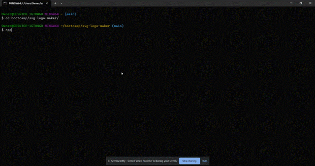

# SVG Logo Maker

This is a Node.js command-line application that allows you to generate a simple logo and save it as an SVG file. With the SVG Logo Maker, you can create logos for your projects without having to hire a graphic designer.

## User Story

As a freelance web developer, I want to generate a simple logo for my projects so that I can have a visually appealing representation for my work.

## Acceptance Criteria

The SVG Logo Maker is a command-line application that accepts user input. It follows the following criteria:

- When prompted for text, you can enter up to three characters.
- When prompted for the text color, you can enter a color keyword or a hexadecimal number.
- When prompted for a shape, you are presented with a list of shapes to choose from: circle, triangle, and square.
- When prompted for the shape's color, you can enter a color keyword or a hexadecimal number.
- When you have entered input for all the prompts, an SVG file is created named `logo.svg`.
- The output text "Generated logo.svg" is printed in the command line.
- When you open the `logo.svg` file in a browser, you are shown a 300x200 pixel image that matches the criteria you entered.

## Walkthrough Video

## Setup and Usage

1. Clone the repository to your local machine.
2. Navigate to the project directory.
3. Run `npm install` to install the required dependencies.
4. Run `node index.js` to start the application.
5. Follow the prompts to enter the text, text color, shape, and shape color for your logo.
6. After providing all the inputs, the SVG file will be generated as `logo.svg` in the root directory of the project.
7. Open the `logo.svg` file in a browser to view the generated logo.

Make sure you have Node.js installed on your machine before running the application.

## Examples

In the `examples` folder, you can find some sample SVG files created with the SVG Logo Maker.

## Technologies Used

- Node.js
- Jest
- Inquirer

## Deployed App
